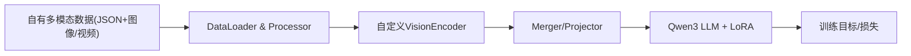

# Qwen3-VL 微调与自定义视觉编码器计划

> 在 Qwen3-VL 仓库中，用自己的数据微调 4B/8B 模型，并支持将视觉 encoder 替换为自定义实现（可选训练或冻结），整体以 LoRA 微调 LLM 和训练投影层为主。

## 待办事项

- [x] 按 QwenVL 要求整理你自己的多模态 JSON 数据和图像/视频文件结构，并在 data/__init__.py 中注册新数据集
- [ ] 基于 Qwen/Qwen3-VL-4B-Instruct 与你的数据，先跑通不改视觉 encoder 的 LoRA+投影层微调流程（脚本：`qwen-vl-finetune/scripts/sft_mimic_4b.sh`）
- [x] 实现或封装你自己的视觉 encoder（HF 模型或自写 PyTorch），输出 `(B, N, D_vis)` 任意 N 均可（qwenvl/vision/）
- [x] 实现 SimpleVisionMerger（不做 patch merge）并替换 model.visual.merger，关闭 DeepStack
- [x] 在 train_qwen.py 中替换 model.visual 并接入自定义 merger（`--custom_vision_encoder rad_dino` 等），脚本：`scripts/sft_mimic_4b_custom_vision.sh`
- [ ] 将稳定的自定义视觉 encoder + 微调配置迁移到 Qwen/Qwen3-VL-8B-Instruct

---

## 一、总体思路

- **基础模型选择**：使用官方提供的 `Qwen/Qwen3-VL-4B-Instruct` 或 `Qwen/Qwen3-VL-8B-Instruct` 作为基座，通过 `--model_name_or_path` 控制 4B / 8B。
- **微调方式**：
  - LLM 部分使用 **LoRA**（`--lora_enable True`），节省显存；
  - **投影层 (model.visual.merger)** 必训（`--tune_mm_mlp True`）；
  - 视觉编码器 `model.visual` 视需求选择是否训练（`--tune_mm_vision True/False`）。
- **数据入口**：采用 `qwen-vl-finetune` 子仓库，主训练脚本为 `qwen-vl-finetune/qwenvl/train/train_qwen.py`，配置与用法见 `qwen-vl-finetune/README.md`。
- **自定义视觉 encoder**：每个 encoder 配一个专属 merger（不做 patch merge），统一关闭 DeepStack；merger 随机初始化后需参与训练。



---

## 二、在你自己数据上微调 4B / 8B 的标准流程

### 1. 环境与依赖

- 按 `qwen-vl-finetune/README.md` 中建议版本安装核心依赖：
  - `torch==2.6.0`, `torchvision==0.21.0`, `transformers==4.57.0.dev0`, `deepspeed==0.17.1`, `flash_attn==2.7.4.post1`, `accelerate==1.7.0`, `peft==0.17.1` 等。
- 确认 CUDA / GPU 驱动满足 bfloat16 和 flash-attn 要求。

### 2. 准备训练数据

- **标注 JSON/JSONL 结构**（参考 `qwen-vl-finetune/README.md` 和 `demo/single_images.json`、`demo/video.json`）：
  - 图像样例：
    - 字段：`image`（字符串或字符串数组）、`conversations`（Q/A 列表）。
    - 提示中用 `<image>`、多图用多个 `<image>`；答案中不要出现这些 special token。
  - 视频样例：
    - 字段：`video` + `conversations`，问句中用 `<video>` 标记。
  - Grounding / 检测数据可参考 README 中 ground 示例，bbox 需要转换为 QwenVL 格式（可用 `tools/process_bbox.ipynb`）。
- **组织文件路径**：
  - 图像/视频相对路径 + `data_path`（见下），或使用绝对路径。
- **打包数据（可选）**：
  - 如需 `--data_packing True`，先用 `qwen-vl-finetune/qwenvl/tools/pack_data.py` 对 JSON 进行 packing 以提高利用率。

### 3. 在 data/__init__.py 注册你的数据集

- 编辑 `qwen-vl-finetune/qwenvl/data/__init__.py`：
  - 按 README 示例新增：
    ```python
    MY_DATASET = {
        "annotation_path": "/path/to/your_annotations.json",  # 或 .jsonl
        "data_path": "/path/to/your_images_or_videos/",       # 如为绝对路径可留空
    }

    data_dict = {
        "my_dataset": MY_DATASET,
        # ... 其他已有数据集
    }
    ```
  - 训练时通过 `dataset_use` 使用，例如：`"my_dataset%100"` 表示采样 100%。

### 4. 选择 4B / 8B 模型与训练脚本

- 参考脚本：`qwen-vl-finetune/scripts/sft_qwen3_4b.sh`
- 关键参数：
  - 4B：`--model_name_or_path Qwen/Qwen3-VL-4B-Instruct`（或 Thinking 版本）。
  - 8B：`--model_name_or_path Qwen/Qwen3-VL-8B-Instruct`。
- 在脚本中替换数据集与路径：
  - `DATASETS="my_dataset%100"`；
  - `MODEL_PATH` 指向对应 HF 路径或本地缓存目录；
  - `OUTPUT_DIR`、`CACHE_DIR` 按需设置。

### 5. 配置微调策略（结合你的需求）

- 在启动 `train_qwen.py` 时设置：
  - **只 LoRA LLM + 训投影层，视觉默认不训**（推荐 baseline）：
    - `--tune_mm_llm True`
    - `--tune_mm_mlp True`
    - `--tune_mm_vision False`
  - **如果希望视觉 encoder 也训**（例如你已经换成自己的 encoder 且需要 joint finetune）：
    - `--tune_mm_vision True`（可配合较小 `--vision_tower_lr`）。
- LoRA 配置（LLM）：
  - `--lora_enable True`
  - `--lora_r 8`、`--lora_alpha 16`、`--lora_dropout 0.0`（可根据显存和任务难度调整）。
- 学习率与组件 LR：
  - 全局：`--learning_rate` 建议在 `1e-6 ~ 2e-7` 区间，根据 batch size 调整；
  - 投影层：`--mm_projector_lr` 通常比 base LR 大（如 `1e-5`）；
  - 视觉塔：`--vision_tower_lr` 更小（如 `1e-6`）以避免破坏预训练表示。

### 6. 分辨率与视频配置

- 图像：
  - `--max_pixels` 和 `--min_pixels` 对性能影响很大：
    - 如 README 示例：`--max_pixels 576*28*28`，`--min_pixels 16*28*28`；
  - 根据显存与任务需要调节（越大越清晰，显存越高）。
- 视频：
  - `--video_fps`、`--video_max_frames`、`--video_min_frames` 控制采样帧数；
  - `--video_max_pixels`、`--video_min_pixels` 控制帧分辨率。

### 7. 启动训练

- 使用 `torchrun` 启动多卡训练，参考 README 脚本：
  - 设置 `MASTER_ADDR`、`MASTER_PORT`、`NPROC_PER_NODE`；
  - 将上述模型路径、数据集名、LoRA、LR 等参数传给 `qwenvl/train/train_qwen.py`。
- **检查要点**：
  - 日志中的 loss 是否正常下降；
  - 显存占用是否在可接受范围内；
  - 定期保存 checkpoint，并在验证集上评估。

---

## 三、替换视觉 encoder 为你自己的实现

> 关键点：每个自定义视觉 encoder 配一个专属 merger，**不做 patch merge**，统一关闭 DeepStack；merger 随机初始化后需参与训练。这样 token 数量不必被 2 或 4 整除。

### 1. 理解当前模型结构

- 加载模型（4B/8B 均同理）：
  - 在训练框架内由 `qwenvl/train/train_qwen.py` 负责，根据 `--model_name_or_path` 中是否包含 `qwen3`/`qwen2.5` 等选择：
    - `Qwen3VLForConditionalGeneration`
    - `Qwen3VLMoeForConditionalGeneration` 等。
- 模型关键子模块（在 HF Transformers 中定义）：
  - `model.visual`：视觉 encoder（类类似 `Qwen3VLVisionModel`）；
  - `model.visual.merger`：将视觉特征映射到 LLM token space 的 projector；
  - `model.language_model`：Qwen3 LLM；
  - `model.lm_head`：输出头。

### 2. SimpleVisionMerger：统一不做 patch merge

自定义 encoder 采用 **SimpleVisionMerger**，只做逐 token 线性投影，不进行 2×2 patch merge：

```python
class SimpleVisionMerger(nn.Module):
    """不做 patch merge，只做逐 token 投影；N 任意，无整除要求"""
    def __init__(self, vis_hidden_size: int, llm_hidden_size: int):
        super().__init__()
        self.proj = nn.Linear(vis_hidden_size, llm_hidden_size)

    def forward(self, x: torch.Tensor) -> torch.Tensor:
        # x: (B, N, D_vis) 或 (seq_len, D_vis)，N 任意
        return self.proj(x)
```

- 输入：`(B, N, D_vis)`，**N 任意**，不必被 2 或 4 整除；
- 输出：`(B, N, D_llm)`，直接送入 LLM；
- 每个 encoder 对应一个 merger，配置示例：`{"hidden_size": 768, "llm_hidden_size": 3584}`（4B）或 4096（8B）。

### 3. 关闭 DeepStack

自定义 encoder 不使用多层 ViT 输出，需关闭 DeepStack：

- 将 `model.visual` 中的 `deepstack_visual_indexes` 设为 `[]`；
- 或保证 `deepstack_merger_list` 为空、forward 时不再取中间层特征。

### 4. 设计你的自定义视觉 encoder 接口

- 输入：图像 / 视频张量（可复用 Qwen processor 的 `pixel_values` 等格式）。
- 输出：`(B, N, D_vis)`，其中 N 为 token 数（任意），D_vis 为 encoder 输出维度。
- 来源：
  - HF 视觉模型（如 ViT）：取 `last_hidden_state` 或中间层输出；
  - 自写 PyTorch 模型：直接产出 `[B, N, D_vis]`。

### 5. 在加载后替换 model.visual 与 merger

1. 通过 `from_pretrained` 加载 Qwen3-VL-4B/8B；
2. 构造你的视觉 encoder 实例；
3. 根据 encoder 的 `D_vis` 和 LLM 的 hidden size 新建 `SimpleVisionMerger`，替换 `model.visual.merger`；
4. 将 `model.visual` 替换为你的 encoder（或封装成与 `model.visual` 接口兼容的模块），并确保 forward 返回格式与 downstream 期望一致；
5. 关闭 DeepStack（`deepstack_visual_indexes=[]` 等）。

### 6. merger 训练策略：单阶段 vs 两阶段

merger 随机初始化，必须参与训练。

- **单阶段（推荐先尝试）**：merger + LLM LoRA 一起训
  - `tune_mm_mlp=True`，`lora_enable=True`
  - merger LR：`1e-5` ~ `2e-5`；LLM LoRA LR：`2e-5` ~ `1e-6`

- **两阶段（若单阶段不稳定）**：
  - 阶段 1：只训 merger，冻结 LLM 和视觉 encoder；
  - 阶段 2：加载阶段 1 的 merger，merger + LLM LoRA 一起训，merger 用稍小 LR。

### 7. 视觉 encoder 是否参与训练

- **不训练视觉 encoder，只训 merger + LLM LoRA（推荐起步）**：
  - 适用场景：视觉 encoder 已在大规模视觉任务上训练充分，只需适配到自己的多模态指令风格。
  - 设置：`--tune_mm_llm True`、`--tune_mm_mlp True`、`--tune_mm_vision False`
- **视觉 encoder 也一起训练**：
  - 适用场景：encoder 本身需要朝你的任务 domain 适配（如医疗、遥感等）。
  - 设置：`--tune_mm_vision True`、`--vision_tower_lr` 较小（如 `1e-6`），同时训练 merger + LLM LoRA。

### 8. 与数据处理代码的对接

- 视觉 encoder 替换后，输入仍通过 Qwen 官方 data processor：
  - `qwen-vl-finetune/qwenvl/data/data_processor.py`：负责将 JSON 中的 `<image>/<video>` 等解析为图像/视频 tensor。
- 为避免大改数据 pipeline：
  - **推荐做法**：保证你的视觉 encoder 能直接消费现有 processor 输出的张量格式（如 `pixel_values`），在内部做自己的归一化 / patch 化即可。

---

## 四、针对你当前情况的推荐落地路径

1. **先跑通原始 4B/8B + 你自己的数据**：
   - 不改视觉 encoder，只使用官方视觉塔；
   - 设置：`tune_mm_llm=True`（LoRA）、`tune_mm_mlp=True`、`tune_mm_vision=False`；
   - 验证整个数据流和训练 pipeline 正常。

2. **在此基础上替换视觉 encoder**：
   - 以 4B 为起点，将 `model.visual` 换成你的实现，并接入 **SimpleVisionMerger**（不做 patch merge）；
   - 关闭 DeepStack：`deepstack_visual_indexes=[]` 或等价方式；
   - 初期建议：**冻结视觉 encoder，只训 merger + LLM LoRA**；优先单阶段联合训练，若不稳定再试两阶段。

3. **如有必要，再开启视觉 encoder 微调**：
   - 小学习率 joint finetune，关注训练稳定性和是否过拟合；

4. **最后迁移到 8B**：
   - 将 4B 上验证好的 encoder + merger 逻辑平移到 `Qwen/Qwen3-VL-8B-Instruct`；
   - 根据显存调整 batch size / 分辨率 / LoRA rank；注意 `llm_hidden_size` 改为 4096。

---

## 总结

整体上，仓库已经把数据格式、训练脚本和参数管理都搭好了，你需要做的关键工作主要是：

- 按 JSON 规范准备数据并在 `data/__init__.py` 注册；
- 用现有脚本跑通 LoRA + 投影层的微调；
- 替换 `model.visual` 为自定义 encoder，替换 `model.visual.merger` 为 **SimpleVisionMerger**（不做 patch merge），关闭 DeepStack；
- 通过 `tune_mm_mlp` / `tune_mm_vision` 控制 merger 和 encoder 的训练范围；merger 随机初始化需参与训练，优先单阶段联合训练。
